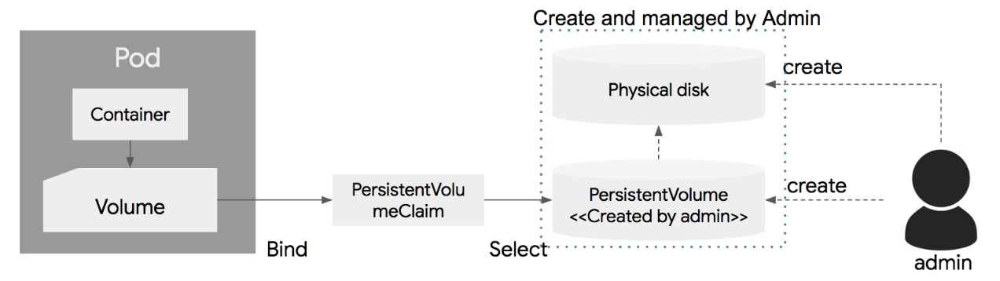

# volume


## 1. volume 의 종류

| Temp     | Local    | Network                                                      |
| -------- | -------- | ------------------------------------------------------------ |
| emptyDir | hostPath | GlusterFS      gitRepo      NFS      iSCSI      gcePersistentDisk      AWS EBS      azureDisk      Fiber Channel      Secret      VshereVolume |


## 2. emptyDir

emptyDir은 Pod가 생성될때 생성되고, Pod가 삭제 될때 같이 삭제되는 임시 볼륨이다. 

단 Pod 내의 컨테이너 크래쉬되어 삭제되거나 재시작 되더라도 emptyDir의 생명주기는 컨테이너 단위가 아니라, Pod 단위이기 때문에, emptyDir은 삭제 되지 않고 계속해서 사용이 가능하다. 

생성 당시에는 디스크에 아무 내용이 없기 때문에, emptyDir  이라고 한다.

다음은 하나의 Pod에 nginx와 redis 컨테이너를 기동 시키고, emptyDir 볼륨을 생성하여 이를 공유하는 설정이다.

```yaml
apiVersion: v1
kind: Pod
metadata:
  name: shared-volumes 
spec:
  containers:
  - name: redis
    image: redis
    volumeMounts:
    - name: shared-storage
      mountPath: /data/shared
  - name: nginx
    image: nginx
    volumeMounts:
    - name: shared-storage
      mountPath: /data/shared
  volumes:
  - name : shared-storage
    emptyDir: {}
```


## 3. hostpath

 hostPath는 노드의 로컬 디스크의 경로를 Pod에서 마운트해서 사용한다. 같은 hostPath에 있는 볼륨은 여러 Pod 사이에서 공유되어 사용된다. 

또한  Pod가 삭제 되더라도 hostPath에 있는 파일들은 삭제되지 않고 다른 Pod가 같은 hostPath를 마운트하게 되면, 남아 있는 파일을 액세스할 수 있다. 


주의할점 중의 하나는 Pod가 재시작되서 다른 노드에서 기동될 경우, 그 노드의 hostPath를 사용하기 때문에, 이전에 다른 노드에서 사용한 hostPath의 파일 내용은 액세스가 불가능하다. 

hostPath는 노드의 파일 시스템을 접근하는데 유용한데, 예를 들어 노드의 로그 파일을 읽어서 수집하는 로그 에이전트를 Pod로 배포하였을 경우, 이 Pod에서 노드의 파일 시스템을 접근해야 한다. 이러한 경우에 유용하게 사용할 수 있다. 

아래는 노드의 /tmp 디렉토리를 hostPath를 이용하여 /data/shared 디렉토리에 마운트 하여 사용하는 예제이다.


```yaml
apiVersion: v1
kind: Pod
metadata:
  name: hostpath
spec:
  containers:
  - name: redis
    image: redis
    volumeMounts:
    - name: terrypath
      mountPath: /data/shared
  volumes:
  - name : terrypath
    hostPath:
      path: /tmp
      type: Directory
```


## 4. 영구 스토리지 사용

영구볼륨을 만드는 방법을 알아보자.


### 1) GCE 디스크 생성

```sh
## cluster 확인
$ gcloud container clusters list
NAME                LOCATION       MASTER_VERSION  MASTER_IP      ...
standard-cluster-1  us-central1-a  1.12.8-gke.10   35.239.97.236  ...

## disk 생성
$ gcloud compute disks create --size=1GiB --zone=us-central1-a userlist-disk
...

## disk 확인
$ gcloud compute disks list 
userlist-disk ...

```


### 2) pod 

생성한 디스크(userlist-disk)를 이용하여 볼륨마운트 한다.

```yaml
# cat 23.userlist-pod.yaml
apiVersion: v1
kind: Pod
metadata:
  name: userlist3-pod
spec:
  containers:
    - name: userlist-container
      image: ssongman/userlist:v1
      volumeMounts:
      - mountPath: "/var/www/html"
        name: my-volume
  volumes:
    - name: my-volume
      gcePersistentDisk:
        fsType: ext4
        pdName: userlist-disk
```


## 5. PV& PVC

개발자와 시스템관리자와의 역할을 분리하기 위해 PV 와 PVC 의 개념이 도입되었다.




PV와 마찬가지로 StrageClass 도 네임스페이스는 지정되지 않는다.


### 1) PV

```yaml
apiVersion: v1
kind: PersistentVolume
metadata:
  name: userlist-pv
  labels:
    app: userlist
spec:
  accessModes:
    - ReadWriteOnce
  capacity:
    #storage: 1Gi
    storage: 100Mi
  persistentVolumeReclaimPolicy: Recycle
  #storageClassName: standard
  gcePersistentDisk:
    fsType: ext4
    #### you have to create pd-disk named userlist-disk before
    pdName: userlist-disk
```


### 2) PVC

```yaml
apiVersion: v1
kind: PersistentVolumeClaim
metadata:
  name: userlist-pvc
spec:
  accessModes:
    - ReadWriteOnce
  volumeMode: Filesystem
  resources:
    requests:
      #storage: 1Gi
      storage: 100Mi
  ### you can choose one of below mothod which are selector and volumeName
  #selector:
  #  matchLabels:
  #    app: userlist
  volumeName: userlist-pv

```

- volumeName : pv 명으로 지정한다.


### 3) POD

```yaml
apiVersion: v1
kind: Pod
metadata:
  name: userlist3-pod
spec:
  containers:
    - name: userlist-container
      image: ssongman/userlist:v1
      volumeMounts:
      - mountPath: "/var/www/html"
        name: my-volume
  volumes:
    - name: my-volume
      persistentVolumeClaim:
        claimName: userlist-pvc
```


## 5. dynamic provisioning

동적생성은 k8s 1.6 부터 지원하는 기능이다.

시스템관리자가 별도로 디스크를 생성하고 PV 를 생성할 필요없이 PVC 만 정의하면 PV 생성을 자동화 한다.


PVC 를 정의하면 쿠버네티스 클러스터가 물리 disk 를 생성하고 연결된 pv 를 생성한다. 디스크생성시 이를 사전에 타입을 정의할 수 있는데, 이를 storageClass 라고 하며 pvc 에서 이를 지정하면 된다. 특별히 지정하지 않는경우는 defualt storageclass 값을 사용하게 된다.

PV와 마찬가지로 StrageClass 도 네임스페이스는 지정되지 않는다.


### 1) google PD StorageClass

```yaml
apiVersion: storage.k8s.io/v1
kind: StorageClass
metadata:
  name: standard
parameters:
  type: pd-standard
provisioner: kubernetes.io/gce-pd
reclaimPolicy: Delete
volumeBindingMode: Immediate
```

PVC요청시 pd-standard type(HDD) 형식의 disk 과 pv 가 만들어지며 자동으로 바인딩된다.


### 2) gce-pd.pd-ssd

```yaml
# fast.storageclass.yaml
apiVersion: storage.k8s.io/v1
kind: StorageClass
metadata:
  name: fase
parameters:
  type: pd-ssd      ### ssd
provisioner: kubernetes.io/gce-pd
reclaimPolicy: Delete
volumeBindingMode: Immediate
```

PVC요청시 pd-ssd type(SSD) 형식의 disk 과 pv 가 만들어지며 자동으로 바인딩된다.


### 3) AWS EBS StorageClass

이렇게 정의한 스토리지 클래스는  PVC 정의시에, storageClassName에 적으면 PVC에 연결이 되고, 스토리지 클래스에 정해진 스펙에 따라서 물리 디스크와 PV를 생성하게 된다. 

```yaml
apiVersion: storage.k8s.io/v1
kind: StorageClass
metadata:
  name: slow
parameters:
  type: io1
  zones: us-est-1d, us-est-1c
  iopsPerGB: "1"
  encrypted: "false"
provisioner: kubernetes.io/aws-ebs
reclaimPolicy: Delete
volumeBindingMode: Immediate
```

-   type: io1, gp2, sc1, st1 를 사용할 수 있다.  default는 gp2
- iopsPerGB : 1 volume 을 위한 유효값


### 4) PVC 

```yaml
apiVersion: v1
kind: PersistentVolumeClaim
metadata:
  name: userlist-pvc
  #annotations:
  #  volume.beta.kubernetes.io/storage-class: fast
spec:
  accessModes:
    - ReadWriteOnce
  resources:
    requests:
      storage: 100Mi
  storageClassName: standard
```

storageClassName: standard 는 생략 가능하며 생략시 기본 storageclass 를 사용한다.


### 5) 실행중인 StorageClass

```sh
$ ks get sc
NAME                 PROVISIONER            AGE
standard (default)   kubernetes.io/gce-pd   2d4h

$ ks get sc standard -o yaml
apiVersion: storage.k8s.io/v1
kind: StorageClass
metadata:
  annotations:
    storageclass.beta.kubernetes.io/is-default-class: "true"
  creationTimestamp: 2019-06-28T08:56:19Z
  labels:
    addonmanager.kubernetes.io/mode: EnsureExists
    kubernetes.io/cluster-service: "true"
  name: standard
  resourceVersion: "281"
  selfLink: /apis/storage.k8s.io/v1/storageclasses/standard
  uid: 986d789d-9982-11e9-b722-42010a8000ec
parameters:
  type: pd-standard
provisioner: kubernetes.io/gce-pd
reclaimPolicy: Delete
volumeBindingMode: Immediate


# gce 생성된 disk 확인
$ gcloud compute disks list
NAME                                                             LOCATION       LOCATION_SCOPE  SIZE_GB  TYPE         STATUS
gke-standard-cluster-1-default-pool-49a1ca2f-j7g4                us-central1-a  zone            100      pd-standard  READY
gke-standard-cluster-1-default-pool-49a1ca2f-k5lr                us-central1-a  zone            100      pd-standard  READY
gke-standard-cluster-1-default-pool-49a1ca2f-np4v                us-central1-a  zone            100      pd-standard  READY
gke-standard-cluster-1-pvc-18c1f9f0-9b1f-11e9-a482-42010a8000a9  us-central1-a  zone            1        pd-standard  READY
gke-standard-cluster-1-pvc-982517c1-9a81-11e9-a482-42010a8000a9  us-central1-a  zone            1        pd-standard  READY


```


## 6. CSI


### GCE

### amazone s3


### EBS StorageClass


