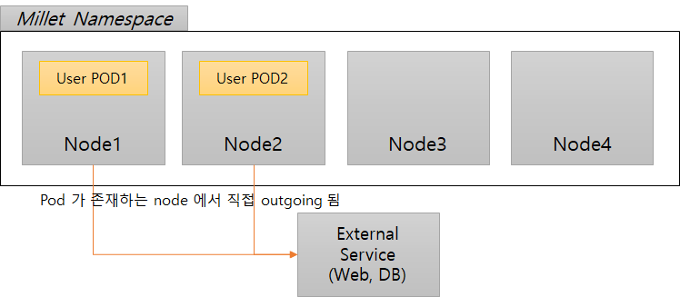
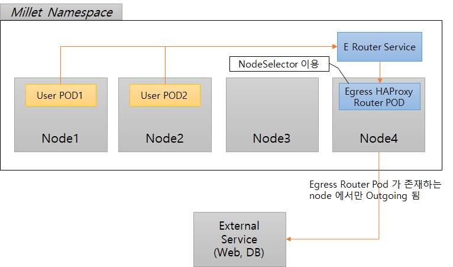
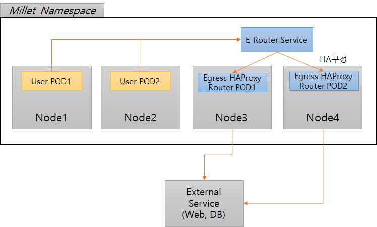
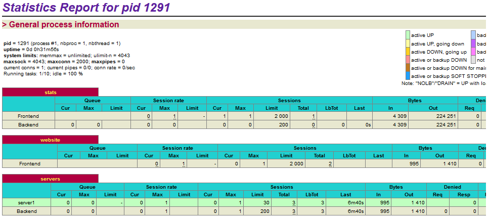

# HAProxy Egress Router


# 1. 개요

Haproxy 는 L4, L7 과 같은 하드웨어 로드밸런서를 대체하기 위한 오픈소스 소프트에어로 이름처럼 Reverse Proxy 를 기반으로 로드밸런싱을 하기에 매우 강력하고 또 가벼운 어플리케이션이다. HA (High Availability) 라는 이름처럼 고가용성을 위하여 설계되었다. Nginx 로드밸런싱과 다른 점은 헬스체크라고 볼 수 있는데, 특정 API 에 접근하여 서버 상태를 점검하고, 문제가 있으면 다른 node 로 트래픽을 넘겨줄 수 있는 기능을 한다.

K8S 에서는 HAProxy로 Egress Router 를 구성하여 outgoing 트래픽을 특정 Node 로 우회시킬수 있다.  외부서버와의 방화벽연결이 필요한 상황에서는 유용하게 사용될 수 있다.


### 1) 일반적인 상태

별도 Egress router 가 없는 일반적인 경우에는 pod가 존재하는 node 에서 직접 outgoing 된다.

그러므로 방화벽이 필요한 외부서비스이고 node 가 지속적으로 추가되는 경우라면 관리의 불편함이 초래된다.




### 2) Egress Router 존재

Outgoing 되는 트래픽을 특정 Node 로 우회 시키기 위해 HAProxy를 이용해서 Egress Router 를 구성한 모습이다. POD 배포시 nodeSelector 또는 nodeName 등을 이용해서 특정 node 를 명시할 수 있다.

  


### 3) Egress Router  HA 구성

Egress Rounter 를 이중화 또는 그 이상을 두어 HA 로 구성할 수 있다.




# 2. Egress 생성 및 테스트


## 2.1. 테스트 시나리오

1)  User pod 내에서 외부서비스(httpbin.org, 35.170.216.115)로 접근시도 확인
2)  Egress POD / Egress Service 생성
3)  외부서비스명 대신 Egress Service 명으로 접근시도


User Pod 에 접근후 아래와 같이 외부서비스로 접근을 시도해 보자.

```bash
$ curl -o /dev/null -s -w "%{http_code}\n" http://httpbin.org/
200         <-- 성공

$ curl -o /dev/null -s -w "%{http_code}\n" http://35.170.216.115/
200         <-- 성공
```


## 2.2. OKD Node 정보

```bash
oc get node -o wide
---
NAME                                STATUS    ROLES     AGE       VERSION           INTERNAL-IP     EXTERNAL-IP   OS-IMAGE                KERNEL-VERSION               CONTAINER-RUNTIME
okd-infra01.192-168-0-214.nip.io    Ready     infra     22d       v1.11.0+d4cacc0   192.168.0.214   <none>        CentOS Linux 7 (Core)   3.10.0-1062.9.1.el7.x86_64   docker://1.13.1
okd-infra02.192-168-0-225.nip.io    Ready     infra     22d       v1.11.0+d4cacc0   192.168.0.225   <none>        CentOS Linux 7 (Core)   3.10.0-1062.9.1.el7.x86_64   docker://1.13.1
okd-master01.192-168-0-211.nip.io   Ready     master    22d       v1.11.0+d4cacc0   192.168.0.211   <none>        CentOS Linux 7 (Core)   3.10.0-1062.9.1.el7.x86_64   docker://1.13.1
okd-node01.192-168-0-216.nip.io     Ready     node      22d       v1.11.0+d4cacc0   192.168.0.216   <none>        CentOS Linux 7 (Core)   3.10.0-1062.9.1.el7.x86_64   docker://1.13.1
okd-node02.192-168-0-217.nip.io     Ready     node      22d       v1.11.0+d4cacc0   192.168.0.217   <none>        CentOS Linux 7 (Core)   3.10.0-1062.9.1.el7.x86_64   docker://1.13.1
okd-node03.192-168-0-228.nip.io     Ready     node      22d       v1.11.0+d4cacc0   192.168.0.228   <none>        CentOS Linux 7 (Core)   3.10.0-1062.9.1.el7.x86_64   docker://1.13.1
okd-node04.192-168-0-229.nip.io     Ready     node      22d       v1.11.0+d4cacc0   192.168.0.229   <none>        CentOS Linux 7 (Core)   3.10.0-1062.9.1.el7.x86_64   docker://1.13.1

```


## 2.3. Egress Pod / Service 


### 1) Configmap 구성

HAProxy 내부에서 실제 트래픽 흐름 정책을 담당할 Configmap 구성


```
cat > 05.haproxy-cfg.yaml
---
apiVersion: v1
data:
  haproxy.cfg: |-
    global
        log         127.0.0.1 local0
        log         127.0.0.1 local1 notice
        maxconn     4000

    defaults
        balance roundrobin
        log     global
        mode    tcp
        option  tcplog
        option  redispatch
        option  log-health-checks
        retries 5
        maxconn 3000
        timeout connect 50s
        timeout client  1m
        timeout server  1m
        
    frontend  mainTest 
        bind *:80
        default_backend backserver
    
    backend backserver
        balance     roundrobin
        server  server1 35.170.216.115:80 check
        server  server2 35.170.216.115:80 check
kind: ConfigMap
metadata:
  labels:
    app: egress-1
    name: egress-1
  name: egress-1-cm
---
```

- frontend : inbound traffic 의 정보를 지정
  - bind : 인입되는 포트 정보
  - mode : http / tcp 등 설정
  - debault_backend : 
-   backend : 이 블록에 로드밸런싱해서 연결할 포트 정보 나열
  - balance : 
  - server : 실제 연결될 포트정보


### 2) POD

- POD 생성


```
cat > 11.egress-1-pod.yaml
---
apiVersion: v1
kind: Pod
metadata:
  name: egress-1
  labels:
    app: egress-1
    name: egress-1
spec:
  containers:
  - name: egress-router
    image: haproxy
    securityContext:
      privileged: true      <-- haproxy 는 내부 network 을 제어하므로 privileged 권한 필요
    volumeMounts:
      - mountPath: /usr/local/etc/haproxy
        name: haproxy-cfg
  nodeName: okd-node01.192-168-0-216.nip.io
  volumes:
    - configMap:
        defaultMode: 420
        name: egress-1-cm
      name: haproxy-cfg
---
```

- cfg 파일 syntax 체크

```
$ oc -n millet exec -it egress-1 bash

$ haproxy -c -f /usr/local/etc/haproxy/haproxy.cfg
Configuration file is valid
```


### 3) Service

```
cat > 12.egress-1-svc.yaml
---
apiVersion: v1
kind: Service
metadata:
  name: egress-1
spec:
  ports:
  - name: http
    port: 80
  - name: https
    port: 443
  - name: cubrid
    port: 33000
  - name: maria
    port: 3306
      type: ClusterIP
      selector:
    name: egress-1
---
```


## 2.4. curl test

```bash
curl -o /dev/null -s -w "%{http_code}\n" http://egress-1/
200
```

Egress Service 명으로 접근해도 성공적으로 return 된다.


## 2.5. resource 

```
$ kubectl top pod
NAME                              CPU(cores)   MEMORY(bytes)
egress-1                          0m           3Mi
```

HAProxy 가 초경량이여서 3MB 정도의 메모리를 차지한다.


# 3. 기타 haproxy 기능


## 3.1 haproxy milti binding

haproxy 는 다응 port binding 기능을 제공한다.

```
cat haproxy.cfg
...
frontend https1
   bind  *:9444 ssl crt /etc/haproxy/ssl/server.pem
   mode http
   use_backend bk1_https

frontend https2
   bind  *:9443 ssl crt /etc/haproxy/ssl/server2.pem
   mode http
   use_backend bk2_https


backend bk1_https
   balance first
   server server1 IP1:9444 check ssl verify none

backend bk2_https
   balance first
   server server1 Ip1:9443 check ssl verify none
...
```


실행전 아래 명령으로 반드시 cfg 파일을 검증하자.

```
haproxy -c -f /path/to/your/haproxy.cfg
```


## 3.2 stats UI 를 이용한 모니터링

haproxy 는 stats 이라고 하는 모니터링 페이지를 기본적으로 제공한다. 어떤 서버에 접속되고 작동하고 있는지 확인하기 편리하다.

